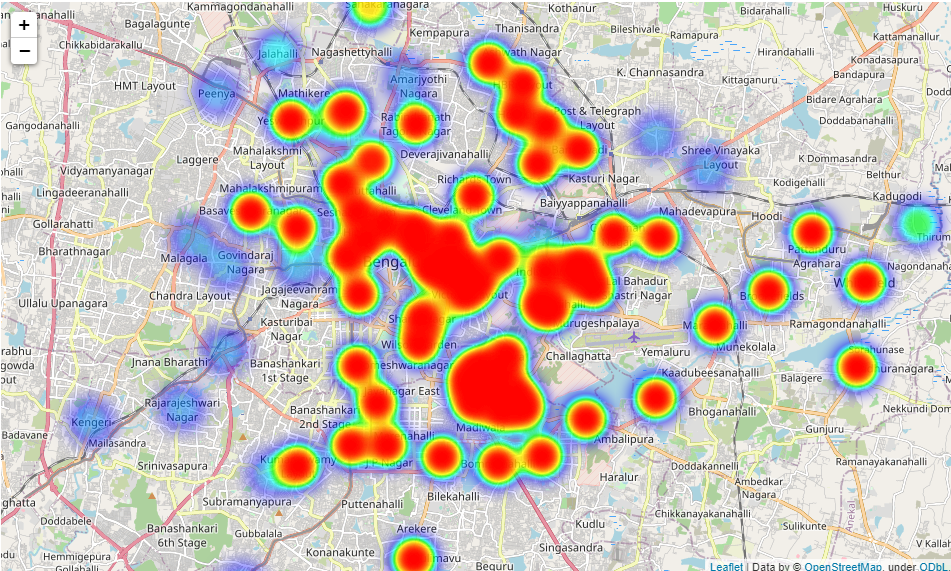
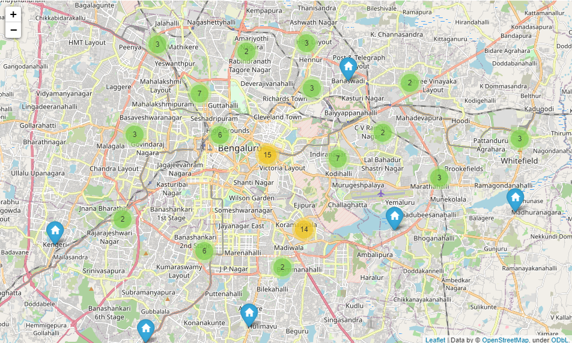
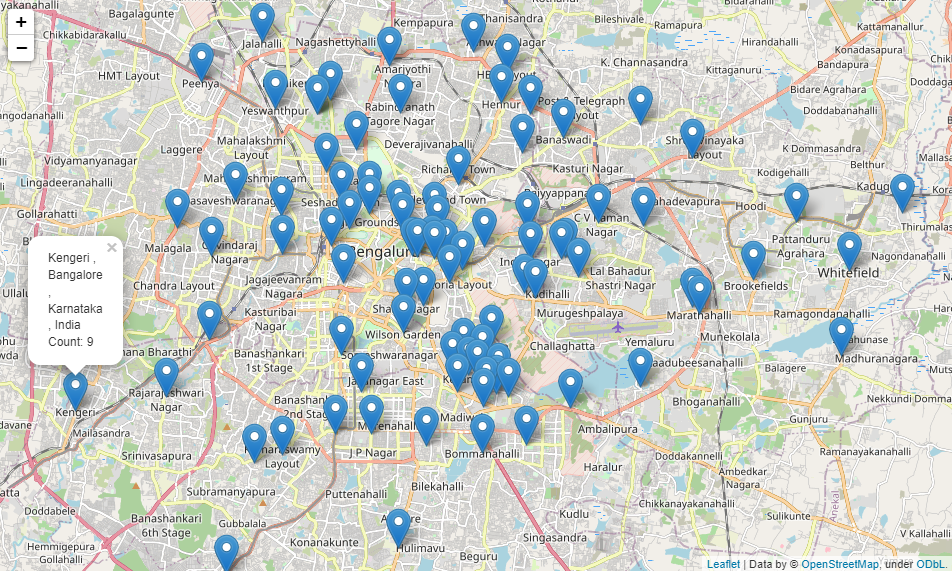
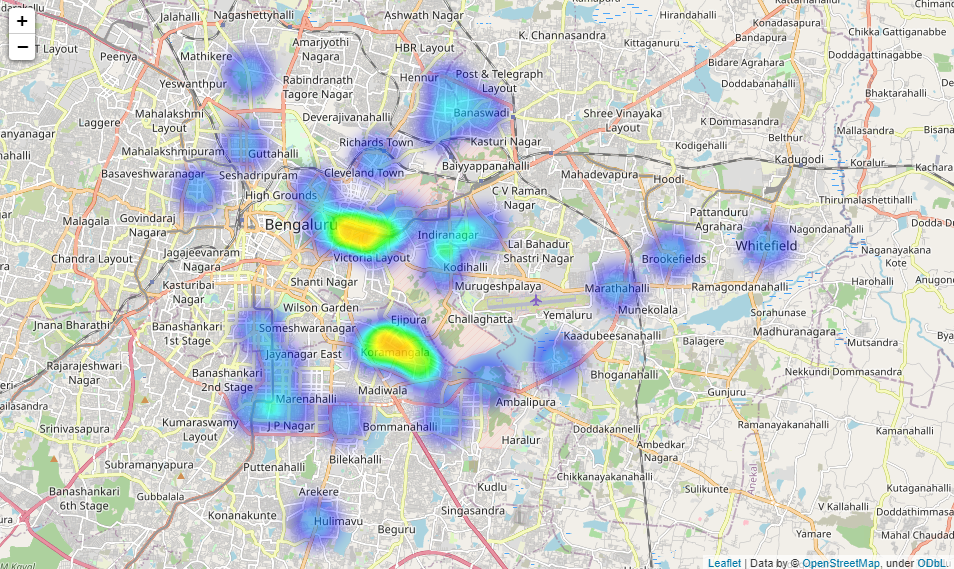

# Mapping Bengaluru's Culinary Landscape: A Spatial Analysis of Zomato Restaurant Data

#### Author: [Steve Githinji](linkedin.com/in/steve-githinji-10ba0114a)

## Overview

This project conducts a spatial analysis of restaurant data from Zomato in Bengaluru, India. By exploring the geographic distribution of restaurants and their attributes, we aim to uncover valuable insights into the city's culinary landscape.

## Business Problem

The primary business objectives of this analysis include:

- Identifying areas with a high concentration of highly-rated restaurants.
- Understanding the geographic distribution of restaurants.
- Exploring market opportunities and operational efficiencies for food delivery platforms.

## Data

We have collected restaurant data from Zomato, which includes information such as restaurant names, locations (latitude and longitude), customer ratings, and more.

## Methods

Our analysis employs various spatial analysis techniques, including:

- Heatmaps to visualize restaurant distribution.
- Marker clustering to manage dense restaurant clusters.
- Interactive maps with detailed restaurant information.
- Filtering and aggregation to focus on high-rating restaurants.

## Results

Below are screen grabs of generated maps:

### 1. Heatmap showing restaurant location density

### 2. Marker cluster showing restaurant locations

### 3. Marker points showing restaurant locations

### 4. Heatmap showing restaurant locations with highest ratings

Key findings of the analysis include:

- Koramangala stands out as an area with a concentration of highly-rated restaurants.
- The Central Business District (CBD) is a hotspot for restaurants, reflecting its importance as a business and leisure hub.
- Insights for operational efficiency and marketing strategies.

## Conclusions

In conclusion, this project provides valuable insights into Bengaluru's restaurant scene, helping stakeholders make data-driven decisions. It highlights areas of culinary excellence, opportunities for market growth, and operational improvements for food service providers.

## Next Steps

Potential next steps for this project include:

- Collaboration with Koramangala restaurants to enhance their visibility.
- Continued monitoring of customer reviews and preferences.
- Exploration of emerging food districts for market expansion.